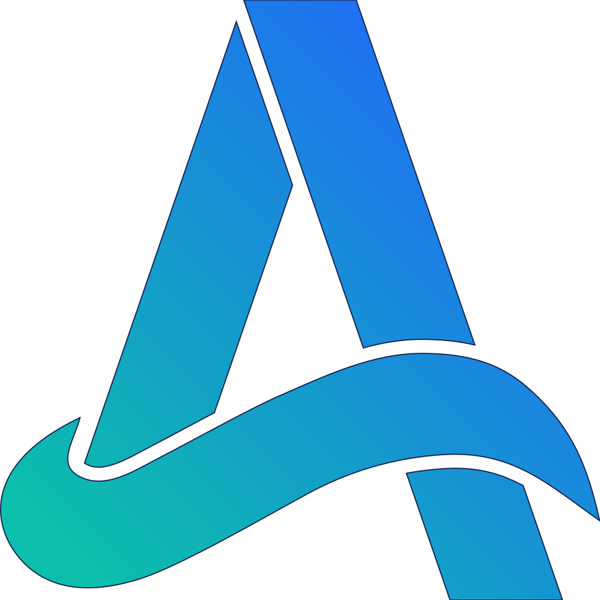

<h1>
  
  Akuna
</h1>

  <strong><em>Knowledge</em> is about more than <em>memory</em>.</strong>

This project aims to service a gap in available context engineering tooling.

Fully featured, while preserving the following key values:

- **Permissive**
  - Open source licensed core
  - All dependencies permissive FOSS
- **Fully Platform Native**
  - AI/ML features can run locally
  - No external runtimes (no pytorch, onnx etc.)
  - Support all common operating systems & device architectures
- **Resource Conscious**
  - Tiny bundle size
  - Respectful of memory & CPU footprint
- **Batteries Included**
  - Sensible defaults everywhere, for painless start
  - Simple top level interfaces, no domain familiarity required

## Core Features

`akuna-core` is a Rust library exposing all key features for use in other projects.

Every AI/ML model in this library is ported to full Rust-native inference using [Burn](https://burn.dev), meaning native hardware acceleration and simple packaging when using this library in your own projects.

| Feature                                           | Kind          | Models / Formats                                                             |
| ------------------------------------------------- | ------------- | ---------------------------------------------------------------------------- |
| [`extraction`](./src-crates/core/src/extraction/) | Text & Code   | `html` / `xhtml` / `xml` / `rss` / `rtf` / `md` / `csv` etc.                 |
|                                                   | Office        | `pdf` / `doc` / `docx` / `pptx` / `epub`                                     |
|                                                   | Images (OCR)  | `png` / `jpg` / `heic` / `webp`                                              |
| [`ocr`](./src-crates/core/src/ocr/)               | Detection     | `PP-OCRv6` — tiny / small / medium                                           |
|                                                   | Recognition   | `PP-OCRv6` — tiny / small / medium                                           |
|                                                   | Layout        | `PP-DocLayoutV3`                                                             |
| [`detection`](./src-crates/core/src/detection/)   | File Types    | `Magika` — 200+ types: documents, images, audio/video, archives, fonts, code |
| [`embedding`](./src-crates/core/src/embedding/)   | MiniLM        | `MiniLM-L6` / `MiniLM-L12`                                                   |
|                                                   | BGE (en v1.5) | `bge-small` / `bge-base` / `bge-large`                                       |
|                                                   | MPNet         | `all-mpnet-base-v2`                                                          |
|                                                   | BGE-M3        | `bge-m3`                                                                     |
| [`reranking`](./src-crates/core/src/reranking/)   | Reranker      | `bge-reranker-base`                                                          |

## Workspace Crates

| Crate        | Path                                       | Purpose                                                                       |
| ------------ | ------------------------------------------ | ----------------------------------------------------------------------------- |
| `akuna`      | [`./src-crates/app/`](./src-crates/app/)   | Main command line application, currently minimal. Much more coming here soon. |
| `akuna-core` | [`./src-crates/core/`](./src-crates/core/) | Core rust library. Knowledge tooling library with feature-gated modules.      |
| `akuna-ffi`  | [`./src-crates/ffi/`](./src-crates/ffi/)   | Foreign-language bindings for `akuna-core` (for use in python, js etc.)       |

### Project Direction

> In a world where everything is a subscription, will we have to rent our own knowledge?

This was the question that started this project. This project aims to bring the knowledge-building & retention local, so that it is not captured and sold back to us as a subscription.

- Vision language model inference for smarter OCR
- Summarisation model inference for text-content summary
- Syntax-tree-aware extraction (document parts based on actual tree not just arbitrary chunking)
- Entity recognition & reification (extract recognisable structured data from textual content)
- Simple-to-use advanced-capability search & retrieval methods (simple scan/index, and search, support multiple retrieval algorithms)
- Live index building for rapid retrieval (watch-for-change reindexing)
- Abstracted storage standards for graph & vector databases (simple api to many backends)
- Live 'alpha' building, to autonomously boost contents' meaning & usefulness (the real end goal...)
